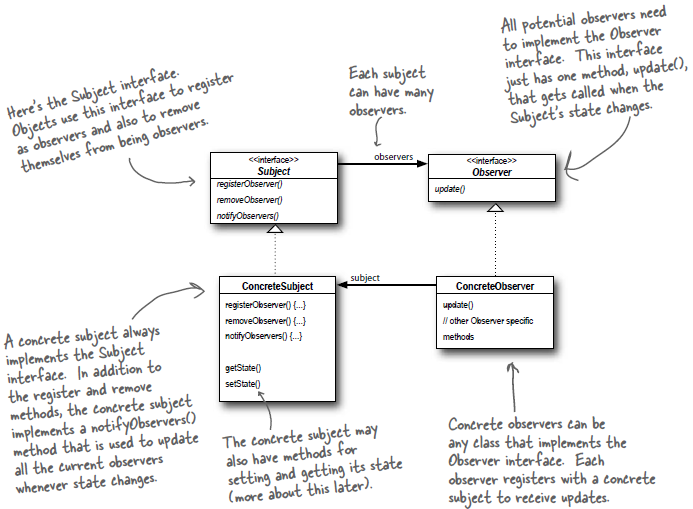

# Observer Pattern

*The observer pattern is a software design pattern in which an object, called the subject, maintains a list of its dependents, called observers, and notifies them automatically of any state changes, usually by calling one of their methods.*

## Principles
1. Strive for loosely coupled designs between objects that interact.

## In Order to Impress Someone
```
The Observer Pattern defines a one-to-many dependency between objects so that when one object changes state, 
all of its dependents are notified and updated automatically.
```

## Easy to understand Diagram
<p align="center">
 Below Diagram is from Head First Design Pattern
</p>


## Class Diagram
<p align="center">
 Below Diagram is from Head First Design Pattern
</p>



## Important Points
* When two objects are loosely coupled they can interact, but have very little knowledge of each other. The Observer Pattern provides an object design where subject and observers are loosely coupled.

## Refrences
* https://www.geeksforgeeks.org/observer-pattern-set-1-introduction/
* https://en.wikipedia.org/wiki/Observer_pattern
