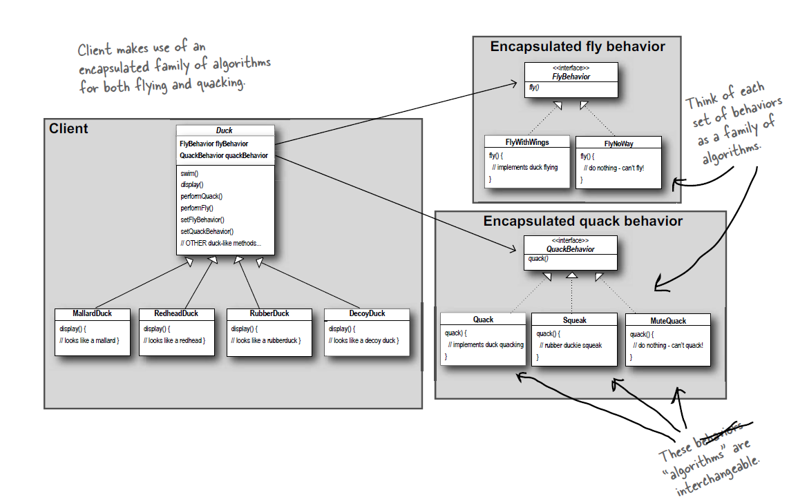

# Strategy Pattern

*It is a behavioral software design pattern that enables selecting an algorithm at run time*

## Principles
1. Identify the aspects of your application that vary and seperate from what stays the same.
2. Program to an Interface, not an implementation.
3. Favour Composition over Inheritance.

## In Order to Impress Someone
```
The Strategy Pattern defines a family of algorithms, encapsulates each one, and makes them interchangeble.
Strategy lets the algorithm vary independently from clients that use it.
```
## Use Case diagram for the above
<p align="center">
 Below Diagram is from Head First Design Pattern
</p>



## Refrences
* https://www.geeksforgeeks.org/strategy-pattern-set-1/
* https://en.wikipedia.org/wiki/Strategy_pattern
